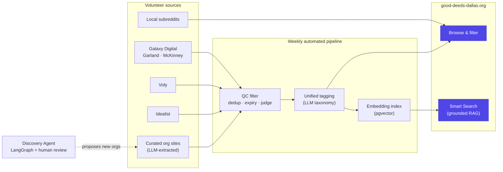

# Good Deeds Dallas

A volunteer-opportunity index for Greater Dallas — built to answer one
question: *what's a real place I could go help this week?*

**[good-deeds-dallas.org](https://www.good-deeds-dallas.org)**

It pulls from half a dozen live sources, cleans and de-duplicates them with
an LLM quality-control pipeline, tags everything against one consistent
cause taxonomy, and layers a natural-language Smart Search on top.

---

## How it works



**Aggregation.** Scrapers pull structured listings straight from Galaxy
Digital sites (Garland, McKinney), Voly, and Idealist, plus an LLM-extraction
pass over a curated list of nonprofit websites that don't publish a
structured feed at all. A lightweight Reddit listener adds local chatter for
context.

**Quality control.** Every LLM-extracted listing runs through a three-stage
filter before it's shown: rule-based deduplication (platforms like Idealist
re-post the same shift many times), automatic expiry (one-time events drop
off after their date passes), and an LLM judge that screens out anything
that isn't a real volunteer role — a 5K signup, a donation drive, a paid
internship slipped in among the real listings. Sources that are already
staffed volunteer platforms skip the judge; they don't need it.

**Unified tagging.** Every source uses its own category labels, so an LLM
pass assigns one consistent set of cause tags (seniors, food security,
animals, environment, ...) — the thing that makes filtering actually work
across sources instead of six incompatible taxonomies.

**Smart Search.** A retrieval-augmented search layer: opportunities are
embedded into Postgres (pgvector, via Supabase), a query gets embedded and
matched by similarity, and an LLM writes a grounded answer from only the
retrieved listings — it's not allowed to invent an opportunity that isn't
actually there.

---

## Discovery Agent

Growing the curated nonprofit list is itself an agent's job. A
[LangGraph](https://langchain-ai.github.io/langgraph/) pipeline searches for
DFW nonprofits the index doesn't cover yet, investigates their websites, and
proposes new entries:

```
build queries → search (Tavily) → triage → investigate → select → propose
```

It automates the *research*, not the *judgment* — every proposal goes
through a human-reviewed dashboard before anything
merges. The LLM layer underneath is provider-agnostic.

---

## Under the hood

- **Frontend** — Next.js 15, React 18, Tailwind
- **Data pipeline** — Python scrapers + LLM classification/QC, run weekly and
  unattended via GitHub Actions
- **Agent** — LangGraph, Tavily search, a Streamlit human-review dashboard
- **Search** — OpenAI embeddings, Supabase/pgvector, grounded LLM answers
- **Guardrails** — durable per-IP and sitewide rate limiting on Smart Search,
  hashed IPs, no raw address storage

The whole thing runs unattended between deploys — the pipeline finds,
quality-checks, re-tags, and re-embeds new listings on its own schedule, with
no manual step required to keep the data current.

---
